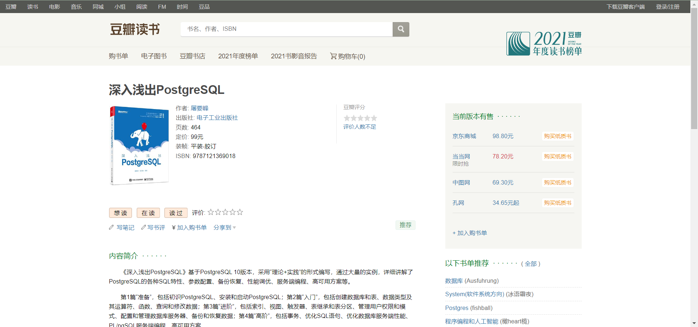

# Head-First-PostgreSQL-Code

《深入浅出PostgreSQL》代码。

## 书籍相关信息

<https://book.douban.com/subject/35005283/>
深入浅出PostgreSQL
作者: 屠要峰
出版社: 电子工业出版社
页数: 464
定价: 99元
装帧: 平装-胶订
ISBN: 9787121369018

豆瓣截图：

注：以下内容复制自豆瓣读书。

### 内容简介

《深入浅出PostgreSQL》基于PostgreSQL 10版本，采用“理论+实践”的形式编写，通过大量的实例，详细讲解了PostgreSQL的各种SQL特性、参数配置、备份恢复、性能调优、服务端编程、高可用方案等。

第1篇“准备”，包括初识PostgreSQL、安装和启动PostgreSQL；第2篇“入门”，包括创建数据库和表、数据类型及其运算符、函数、查询和修改数据；第3篇“进阶”，包括索引、视图、触发器、表继承和表分区、管理用户权限和模式、配置和管理数据库服务器、备份和恢复数据；第4篇“高阶”，包括事务、优化SQL语句、优化数据库服务端性能、PL/pgSQL服务端编程、高可用方案。

《深入浅出PostgreSQL》结构清晰、内容翔实、案例丰富、通俗易懂、实用性强，适合对数据库（特别是PostgreSQL）感兴趣的读者自学参考。另外，本书也适合...

### 作者简介

屠要峰

研究员、中兴通讯数据库技术专家委员会主任、研究院副院长、CCF信息存储委员会常委、中国开源软件联盟理事。拥有二十多年大型软件系统研发实践经验，主持过大数据、云计算、云存储及分布式数据库等多个大型分布式系统的研发。负责中兴通讯数据智能方向的研发及应用，获省级科技进步一等奖两次。主要研究方向为大数据、云计算、数据库及存储。

陈河堆

现任中兴通讯数据库平台首席专家，PostgreSQL中文社区核心组成员，拥有十几年数据库研发工作经验，曾参与公司自研高性能内存数据库、分布式数据库和分布式缓存等系统的设计和开发，近年来醉心于钻研开源数据库技术，热心推动PostgreSQL在中国地区的推广和应用，积极参与PostgreSQL中文社区系列活动。

### 目录

-
------------------第1篇 准备

-
第1章 初识PostgreSQL 2
1.1 PostgreSQL的起源 2
1.2 PostgreSQL简介 3
-1.2.1 基本概念 3
-1.2.2 存储体系结构 4
-1.2.3 进程体系架构 6
1.3 PostgreSQL 10版本的新特性 6
1.4 小结 7
第2章 安装和启动PostgreSQL 8
2.1 安装PostgreSQL 8
-2.1.1 在Windows中安装PostgreSQL 8
-2.1.2 在Linux中安装PostgreSQL 12
-2.1.3 源码安装PostgreSQL 14
2.2 初始化数据库 17
2.3 数据库的基本配置 18
-2.3.1 配置数据库监听IP和端口 18
-2.3.2 配置数据库错误日志 18
2.4 启动、停止、查看数据库 18
-2.4.1 启动数据库 18
-2.4.2 停止数据库 19
-2.4.3 查看数据库状态 19
2.5 小结 19
-
------------------第2篇 入门
-
第3章 创建数据库和表 21
3.1 认识SQL语言 21
-3.1.1 SQL语句类型 21
-3.1.2 SQL数据类型 21
3.2 使用交互式终端psql 22
-3.2.1 连接数据库 22
-3.2.2 常用命令 23
-3.2.3 使用技巧 26
3.3 表空间的创建、修改和删除 27
-3.3.1 【实例1】创建表空间 27
-3.3.2 【实例2】修改表空间 29
-3.3.3 【实例3】删除表空间 29
3.4 数据库的创建、修改和删除 30
-3.4.1 【实例4】创建数据库 30
-3.4.2 【实例5】修改数据库 31
-3.4.3 【实例6】删除数据库 32
3.5 创建数据表 32
-3.5.1 创建表的语法格式 32
-3.5.2 使用CHECK约束 35
-3.5.3 使用非空约束 36
-3.5.4 使用唯一性约束 36
-3.5.5 使用主键约束 37
-3.5.6 使用默认约束 38
-3.5.7 使用外键约束 38
-3.5.8 【实例7】设置表的属性值自动增加 40
-3.5.9 【实例8】查看表结构 41
3.6 修改数据表 42
-3.6.1 【实例9】修改表名 42
-3.6.2 【实例10】修改字段名 43
-3.6.3 【实例11】添加字段 43
-3.6.4 【实例12】删除字段 44
-3.6.5 【实例13】删除表的外键约束 44
3.7 删除数据表 46
-3.7.1 【实例14】删除没有被关联的表 46
-3.7.2 【实例15】删除被其他表关联的主表 46
3.8 数据的插入、修改和删除 47
-3.8.1 【实例16】向表中插入数据 47
-3.8.2 【实例17】修改表中的数据 48
-3.8.3 【实例18】删除表中的数据 49
3.9 数据的简单查询 50
-3.9.1 【实例19】创建最简单的单表查询 50
-3.9.2 【实例20】创建带过滤条件的查询 50
3.10 小结 51
-
第4章 数据类型及其运算符 52
4.1 数值类型 52
-4.1.1 整数类型 52
-4.1.2 任意精度数字类型 53
-4.1.3 浮点类型 53
-4.1.4 序列类型 54
-4.1.5 货币类型 55
-4.1.6 【实例21】使用数学运算符 55
4.2 字符串类型 56
-4.2.1 字符串类型分类 57
-4.2.2 使用连接运算符 57
-4.2.3 使用模式匹配运算符 58
4.3 二进制数据类型 60
-4.3.1 二进制数据类型简介 60
-4.3.2 二进制数据的十六进制格式 61
-4.3.3 二进制数据的转义格式 61
4.4 日期类型和时间类型 61
-4.4.1 日期类型和时间类型分类 61
-4.4.2 日期类型和时间类型输入格式 62
-4.4.3 日期类型和时间类型输出格式 64
-4.4.4 时区 64
-4.4.5 使用日期类型和时间类型运算符 65
4.5 布尔类型 66
-4.5.1 布尔类型简介 66
-4.5.2 布尔类型运算符 66
4.6 位串类型 68
-4.6.1 位串类型简介 68
-4.6.2 【实例22】使用位串类型运算符 68
4.7 枚举类型 69
-4.7.1 声明枚举类型 69
-4.7.2 排序 69
-4.7.3 注意枚举类型安全性 70
4.8 几何类型 71
-4.8.1 点（point） 71
-4.8.2 线（line） 72
-4.8.3 线段（lseg） 72
-4.8.4 矩形（box） 73
-4.8.5 路径（path） 74
-4.8.6 多边形（polygon） 75
-4.8.7 圆（circle） 75
-4.8.8 【实例23】使用几何类型运算符 76
4.9 JSON数据类型 77
-4.9.1 JSON数据类型简介 77
-4.9.2 JSON数据类型的输入/输出语法 78
-4.9.3 【实例24】使用json运算符 79
-4.9.4 【实例25】使用jsonb运算符 79
4.10 范围类型 80
-4.10.1 内建范围类型 80
-4.10.2 范围类型的边界 81
-4.10.3 范围值的输入 81
-4.10.4 使用范围类型运算符 82
-4.10.5 【实例26】定义自己的范围类型 83
4.11 数组类型 83
-4.11.1 定义数组类型 84
-4.11.2 输入数组 84
-4.11.3 访问数组 86
-4.11.4 修改数组 87
-4.11.5 查找数组中的内容 88
-4.11.6 数组运算符 89
4.12 小结 89
第5章 函数 90
5.1 数学函数 90
-5.1.1 认识数学函数 90
-5.1.2 【实例27】用数学函数对小数取整 93
5.2 字符串函数 94
-5.2.1 认识字符串函数 95
-5.2.2 认识二进制字符串函数 99
-5.2.3 【实例28】用format()函数格式化输出 101
5.3 数据类型格式化函数 103
5.4 序列函数 104
-5.4.1 认识序列函数 104
-5.4.2 【实例29】创建及使用序列函数 104
5.5 日期函数和时间函数 107
-5.5.1 认识日期函数和时间函数 107
-5.5.2 【实例30】用AT TIME ZONE进行时区转换 110
-5.5.3 【实例31】获取当前的日期和时间 111
-5.5.4 【实例32】设置延时执行 112
5.6 位串函数 113
-5.6.1 认识位串函数 113
-5.6.2 【实例33】用bit()函数转换整数和位串 113
5.7 枚举函数 114
-5.7.1 认识枚举函数 114
-5.7.2 【实例34】用枚举函数获取枚举类型中的值 114
5.8 几何函数 115
-5.8.1 认识几何函数 115
-5.8.2 【实例35】用area()函数计算几何类型的面积 117
5.9 JSON函数 117
-5.9.1 JSON创建函数 117
-5.9.2 JSON处理函数 118
-5.9.3 【实例36】用to_json()函数将字符串转换成JSON格式 122
-5.9.4 【实例37】用json_array_length()函数统计JSON数据类型中的元素个数 122
5.10 范围函数 123
-5.10.1 认识范围函数 123
-5.10.2 【实例38】用range_merge()函数获取一个包含给定范围的最小范围 123
-5.10.3 【实例39】用upper_inc()函数判断上界是否被包含在范围内 123
5.11 数组函数 124
-5.11.1 认识数组函数 124
-5.11.2 【实例40】用array_position()函数在数组中检索数据 125
-5.11.3 【实例41】用array_to_string()函数将数组转为字符串 126
5.12 其他函数 126
-5.12.1 聚合函数 126
-5.12.2 集合返回函数 131
-5.12.3 系统信息函数 131
-5.12.4 系统管理函数 133
5.13 小结 134
第6章 查询和修改数据 135
6.1 SELECT语法 135
6.2 单表查询 136
-6.2.1 【实例42】简单查询 136
-6.2.2 【实例43】等值查询 137
-6.2.3 【实例44】范围查询 137
-6.2.4 【实例45】去重 138
-6.2.5 【实例46】排序 140
-6.2.6 【实例47】分组 140
-6.2.7 【实例48】分页 141
6.3 多表查询 142
-6.3.1 【实例49】内连接 143
-6.3.2 【实例50】外连接 144
-6.3.3 【实例51】交叉连接 146
-6.3.4 【实例52】多表关联复合查询 146
6.4 子查询 147
-6.4.1 【实例53】IN/NOT IN 子查询 147
-6.4.2 【实例54】EXISTS/NOT EXISTS子查询 148
-6.4.3 【实例55】ANY/SOME/ALL子查询 149
6.5 模糊匹配查询 150
-6.5.1 【实例56】LIKE查询 150
-6.5.2 【实例57】SIMILAR TO查询 152
6.6 查询运算 152
-6.6.1 【实例58】聚集运算 152
-6.6.2 【实例59】分组运算 154
-6.6.3 【实例60】表达式运算 156
-6.6.4 【实例61】递归查询 157
6.7 窗口函数 158
6.8 高级操作 162
-6.8.1 【实例62】归并数据 162
-6.8.2 【实例63】批量插入 164
-6.8.3 【实例64】批量更新 165
-6.8.4 【实例65】关联更新 166
-6.8.5 【实例66】批量删除 166
-6.8.6 【实例67】关联删除 166
-6.8.7 【实例68】移动数据到历史表 167
-6.8.8 【实例69】清空表 167
6.9 小结 168
-
------------------第3篇 进阶
-
第7章 索引 170
7.1 索引简介 170
-7.1.1 索引的含义和作用 170
-7.1.2 索引的分类 171
-7.1.3 索引的设计原则 172
7.2 索引操作 172
-7.2.1 创建索引 172
-7.2.2 修改索引 174
-7.2.3 删除索引 175
7.3 常用索引方法 176
-7.3.1 多列索引 176
-7.3.2 组合索引 177
-7.3.3 唯一索引 177
-7.3.4 表达式索引 178
-7.3.5 部分索引 178
-7.3.6 索引与排序 180
7.4 索引类型 180
-7.4.1 B-tree索引 180
-7.4.2 Hash索引 181
-7.4.3 GiST索引 182
-7.4.4 SP-GiST索引 184
-7.4.5 GIN索引 185
-7.4.6 BRIN索引 186
7.5 索引使用案例 187
-7.5.1 【实例70】用GiST索引提升RANGE类型数据的查询性能 187
-7.5.2 【实例71】用SP-GiST索引快速查找几何空间数据 189
-7.5.3 【实例72】用GIN索引快速查找JSON数据 190
-7.5.4 【实例73】用BRIN索引快速检索时间类型数据 192
7.6 小结 194
-
第8章 视图 195
8.1 为什么使用视图 195
8.2 普通视图 195
-8.2.1 创建视图 196
-8.2.2 使用视图 198
8.3 物化视图 201
-8.3.1 物化视图和普通视图的区别 201
-8.3.2 创建和刷新物化视图 201
-8.3.3 【实例74】用物化视图优化查询性能 203
8.4 小结 205
-
第9章 触发器 206
9.1 常规触发器 206
-9.1.1 了解常规触发器 206
-9.1.2 【实例75】创建触发器 208
-9.1.3 【实例76】修改触发器 211
-9.1.4 【实例77】删除触发器 212
-9.1.5 【实例78】注意数据变更的可见性 213
9.2 事件触发器 214
-9.2.1 事件触发器支持的事件 214
-9.2.2 【实例79】创建一个具有数据库审计功能的事件触发器 215
9.3 小结 217
第10章 表继承和表分区 218
10.1 表继承 218
-10.1.1 表继承的使用场景 218
-10.1.2 【实例80】创建表继承 219
-10.1.3 【实例81】使用表继承 221
-10.1.4 确定表继承数据来源 228
-10.1.5 表继承的局限性和注意事项 230
10.2 表分区 231
-10.2.1 表分区的使用场景 231
-10.2.2 表分区的实现方式 232
-10.2.3 【实例82】创建表分区 233
-10.2.4 【实例83】使用表分区 235
-10.2.5 【实例84】维护表分区 237
-10.2.6 使用约束排除提升查询性能 240
-10.2.7 表分区注意事项 243
10.3 小结 243
第11章 管理用户权限和模式 244
11.1 了解用户、角色和权限 244
11.2 管理用户、角色和权限 245
-11.2.1 【实例85】创建用户 245
-11.2.2 【实例86】删除用户 246
-11.2.3 【实例87】创建角色 247
-11.2.4 【实例88】删除角色 249
-11.2.5 【实例89】给角色授予权限 250
-11.2.6 【实例90】使用系统默认角色 251
11.3 管理数据库模式 252
-11.3.1 【实例91】使用数据库模式 252
-11.3.2 【实例92】设置模式的搜索路径 253
-11.3.3 管理数据库模式权限 254
-11.3.4 pg_catalog模式 254
11.4 小结 255
第12章 配置和管理数据库服务器 256
12.1 用不同方式进行参数设置 256
-12.1.1 了解参数格式 256
-12.1.2 【实例93】通过配置文件设置参数 257
-12.1.3 【实例94】通过SQL命令设置参数 259
-12.1.4 【实例95】通过shell命令设置参数 261
-12.1.5 【实例96】用include方式管理配置文件 262
12.2 配置postgresql.conf文件的参数 262
-12.2.1 连接和安全认证参数 263
-12.2.2 缓存和存储参数 264
-12.2.3 WAL日志参数 266
-12.2.4 错误日志参数 267
-12.2.5 AUTOVACUUM参数 274
12.3 配置pg_hba.conf文件的参数 274
-12.3.1 了解不同客户端认证方法 275
-12.3.2 【实例97】用trust配置客户端认证 276
-12.3.3 【实例98】用md5配置客户端认证 277
-12.3.4 【实例99】用cert配置客户端认证 277
12.4 服务端常用工具 277
-12.4.1 【实例100】用initdb初始化数据库 277
-12.4.2 【实例101】用pg_ctl管理数据库服务 278
-12.4.3 【实例102】用pg_controldata查看控制信息 280
-12.4.4 【实例103】用pg_rewind同步数据目录 282
12.5 小结 283
第13章 备份和恢复数据 284
13.1 逻辑备份和恢复 284
-13.1.1 【实例104】用pg_dump工具备份单库单表数据 284
-13.1.2 【实例105】用pg_restore工具恢复数据 287
-13.1.3 【实例106】用pg_dumpall工具备份所有库表数据 289
-13.1.4 【实例107】用psql工具恢复pg_dumpall备份的数据 289
13.2 物理备份和恢复 289
-13.2.1 【实例108】用pg_basebackup工具热备份 290
-13.2.2 【实例109】用基础备份恢复数据 292
13.3 增量备份和恢复 293
-13.3.1 【实例110】用归档日志进行增量备份 293
-13.3.2 【实例111】将数据库状态恢复到指定时间点 294
-13.3.3 【实例112】恢复到指定事务 297
13.4 第三方备份恢复工具 299
-13.4.1 认识pg_rman工具 299
-13.4.2 【实例113】用pg_rman工具备份数据 301
13.5 小结 304
-
------------------第4篇 高阶
-
第14章 事务 306
14.1 事务的基本特性 306
-14.1.1 事务模型要解决的问题 306
-14.1.2 事务的四大特性 307
-14.1.3 【实例114】设置合适的事务隔离级别 308
14.2 理解事务的实现原理 310
-14.2.1 WAL机制 310
-14.2.2 MVCC机制 311
-14.2.3 Checkpoint机制 314
-14.2.4 Crash Recovery机制 315
-14.2.5 事务并发与锁机制 316
14.3 使用事务 319
-14.3.1 理解事务语法 319
-14.3.2 【实例115】用ROLLBACK回滚事务 320
-14.3.3 【实例116】用COMMIT提交事务 321
-14.3.4 【实例117】用SAVEPOINT回滚部分事务 321
14.4 小结 323
第15章 优化SQL语句 324
15.1 理解查询优化器的工作原理 324
-15.1.1 SQL语句执行过程 324
-15.1.2 了解查询树 325
-15.1.3 了解逻辑优化 326
-15.1.4 逻辑优化：对子查询进行优化 326
-15.1.5 逻辑优化：条件表达式优化及等价谓词重写优化 327
-15.1.6 逻辑优化：外连接优化 328
-15.1.7 了解物理优化 329
15.1.8 代价估算 332
15.2 查看并分析执行计划 334
-15.2.1 EXPLAIN命令介绍 334
-15.2.2 EXPLAIN输出解读 336
-15.2.3 【实例118】用EXPLAIN分析执行计划 338
15.3 常见SQL语句优化 343
-15.3.1 【实例119】用索引避免表扫描 343
-15.3.2 【实例120】子查询优化 345
15.3.3 【实例121】表连接优化 347
-15.3.4 【实例122】用UNION ALL代替UNION 349
-15.3.5 【实例123】避免使用“SELECT *” 350
-15.3.6 【实例124】为jsonb字段建立合适的索引 351
15.4 小结 352
第16章 优化数据库服务端性能 353
16.1 了解数据库性能指标 353
-16.1.1 衡量数据库性能的指标 353
-16.1.2 影响数据库性能的硬件因素 353
-16.1.3 【实例125】用nmon工具监控Linux性能 356
16.2 优化存储性能 359
-16.2.1 物理存储介质简介 359
-16.2.2 存储路径隔离原则 361
16.3 优化数据库配置参数 366
-16.3.1 优化内存资源类参数 366
-16.3.2 优化脏页刷写类参数 368
-16.3.3 优化空间回收类参数 369
-16.3.4 优化WAL日志文件相关参数 372
-16.3.5 数据库性能视图 376
16.4 小结 383
第17章 PL/pgSQL服务端编程 384
17.1 PL/pgSQL编程基础 384
-17.1.1 PL/pgSQL的结构 384
-17.1.2 PL/pgSQL的声明 386
-17.1.3 PL/pgSQL的表达式 389
-17.1.4 PL/pgSQL的基本语句 389
-17.1.5 PL/pgSQL的控制结构 392
-17.1.6 PL/pgSQL的游标 399
-17.1.7 PL/pgSQL的错误和消息 401
-17.1.8 PL/pgSQL的触发器函数 402
17.2 PL/pgSQL 编程实战 405
-17.2.1 PL/pgSQL开发建议 405
-17.2.2 【实例126】编写一个自定义用户函数 407
-17.2.3 【实例127】从PL/SQL移植到PL/pgSQL 409
17.3 小结 411
第18章 高可用方案 412
18.1 如何实现高可用方案 412
-18.1.1 基本概念 412
-18.1.2 实现自动故障接管（Failover） 414
-18.1.3 WAL归档与流复制 415
-18.1.4 防止WAL日志文件被过早删除 418
-18.1.5 巧用级联复制 419
-18.1.6 同步复制与读写分离 420
18.2 【实例128】基于Corosync+Pacemaker的方案 424
-18.2.1 初识Corosync和Pacemaker 424
-18.2.2 Corosync和Pacemaker的安装 426
-18.2.3 基于Corosync+Pacemaker的高可用方案及实现 430
18.3 【实例129】基于Stolon的方案 436
-18.3.1 Stolon方案架构及特性 436
-18.3.2 Stolon方案安装配置及【实例 437
18.4 小结 443